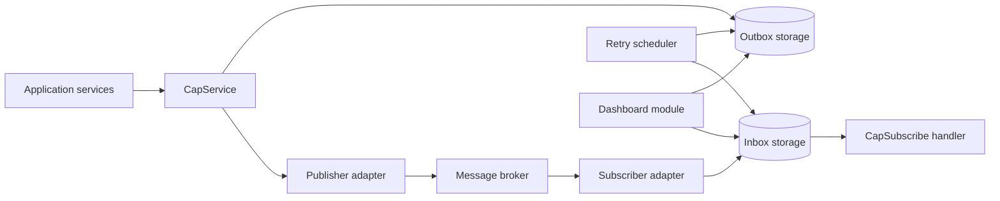
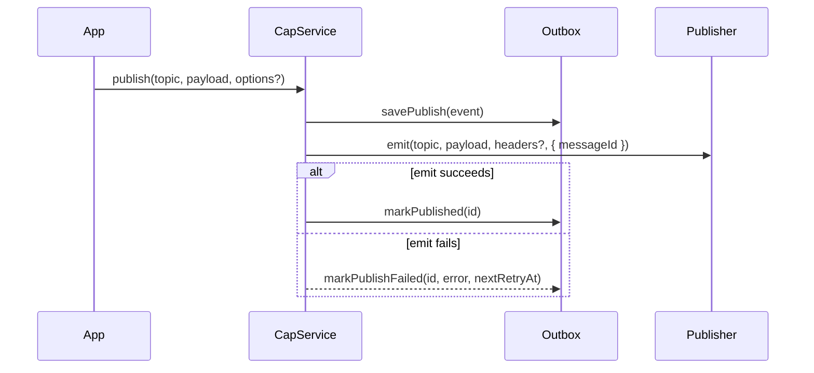
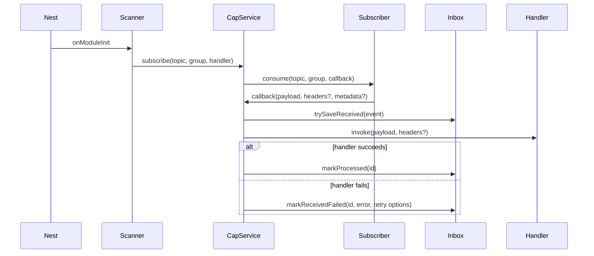

# Architecture

CAP provides reliable message publication and consumption for Node.js
applications. It does this by persisting messages before transport work and by
retrying failed outbox or inbox work through a scheduler.

CAP sits below application use cases and beside framework or broker transport
abstractions. It is not a replacement for `@nestjs/microservices`; instead, CAP
owns durable message state while framework and transport adapters decide how
messages leave or enter the process.

## System Overview

The core package owns orchestration and contracts. Storage and transport are
provided through `cap-core` ports that framework adapters bind into their
runtime:

- `PUBLISH_STORAGE` and `RECEIVED_STORAGE`
- `PUBLISHER` and `SUBSCRIBER`

First-party adapters currently exist for MikroORM, Knex, TypeORM, and Prisma
storage, and Azure Service Bus, NestJS microservices, RabbitMQ, Kafka, and
AWS SNS/SQS transport. Applications can
provide different adapters by implementing the same interfaces.

`CapModule` is intentionally global for v1. Register it once at the application
root with the storage and transport modules it should use; `CapService` is then
available app-wide through Nest dependency injection.

## Framework Integration Boundary

Storage adapter roots are framework-neutral. In particular,
`@mikara89/cap-storage-knex`, `@mikara89/cap-storage-typeorm`, and
`@mikara89/cap-storage-prisma` must not import NestJS from their root entry
points or make Nest peers necessary for direct adapter use. Their concrete
storage providers are constructed from an application-owned Knex instance,
TypeORM `DataSource`, or Prisma-compatible client.

Optional Nest integration is isolated behind explicit `/nest` subpaths:

- `@mikara89/cap-storage-knex/nest`
- `@mikara89/cap-storage-typeorm/nest`
- `@mikara89/cap-storage-prisma/nest`

Those modules bind the existing `PUBLISH_STORAGE` and `RECEIVED_STORAGE`
symbols; they do not introduce replacement CAP contracts or tokens. Knex and
Prisma applications select the provider token explicitly. TypeORM uses the
standard default or named `@nestjs/typeorm` data-source token.

The modules reuse rather than own database/client lifecycles: application code
creates, connects, closes, and configures the Knex instance, TypeORM data
source, or Prisma client. Express has no DI-module convention, so it continues
to use explicit construction of framework-neutral adapter objects through
`@mikara89/cap-express`, without adapter-specific wrappers.

## Publish Flow

The outbox row is always written before an external emit is attempted. If the
transport fails, the row remains eligible for scheduler retry.

## Subscribe Flow

`CapSubscriberScanner` scans Nest providers for `@CapSubscribe` metadata and
registers handlers during module initialization. DTO validation is available
through the `dto` option on `@CapSubscribe`.

Handlers receive headers either as the second argument or through the
`@CapHeaders()` parameter decorator.

## Transport Contract Boundary

The adapter-neutral transport surface is intentionally small. Publishers map a
logical topic, JSON-compatible payload, CAP headers, and stable message ID to a
client send operation. Subscribers register a logical `topic + group` handler
and pass payload, headers, and available message/deduplication identity inward.
Transport errors remain observable at this boundary.

CAP owns durable outbox/inbox records and application-handler retry. The public
subscriber port exposes no acknowledgement or delivery-handle API, so broker
settlement, commits, and broker redelivery remain adapter/client-owned. The
common conformance suite verifies handler success and failure propagation; it
does not claim portable acknowledgement semantics.

Optional initialization and subscriber disposal are tested only when an
adapter declares support. Publisher disposal is not part of `PublisherPort`;
the Azure adapter's sender cleanup is an adapter lifecycle extension. No core
transport capability interface is introduced until real adapter variation is
both implemented and testable.

See the [transport adapter author guide](transport-adapter-author-guide.md) for
the verified behavior of the current adapters.

## Retry Scheduler

The scheduler is registered by `CapModule` and performs two periodic jobs:

- outbox flush every 30 seconds
- inbox retry every minute

Outbox retries claim eligible rows with a lease before emitting them. The
claim owner is an opaque token that is unique to each claim round, not a stable
process identity. CAP renews a claim once before broker emission and then at
roughly one third of the configured lease interval while the emit remains in
flight. Renewals never overlap. If renewal fails or the row no longer belongs
to that token, CAP lets an already-started broker call settle but does not mark
the row published or failed; another worker may reclaim it for at-least-once
redelivery.

First-party durable adapters fence completion, failure, and renewal with atomic
`id + processing status + lockedBy` predicates. This prevents an expired worker
from mutating a row after another worker reclaims it. A lease cannot cancel an
in-flight broker operation, so consumers must still be idempotent and tolerate
duplicate delivery.

The
MikroORM storage adapter uses pessimistic partial write locking for production
claim safety on lock-capable SQL drivers. SQLite and other local/non-locking
drivers use a fallback intended only for demos, development, and single-process
tests; they are not supported for multi-instance durable dispatch. The current
first-party MikroORM multi-instance DB gate covers PostgreSQL and MySQL. SQL
Server needs a SQL Server-specific claim implementation before it is supported
for multi-instance dispatch. Failed emits increment retry state and eventually
move rows to `dead_letter`.

Inbox retries read due `failed` rows and re-run the registered handler. Handler
failures increment retry state, store `lastError`, and eventually move rows to
`dead_letter` once `scheduler.maxInboxRetries` is reached. Handler retry timing
uses exponential backoff with jitter.

## Transactions

`CapService.publish(topic, payload, { headers, tx, ctx, immediate }?)` supports
transaction-aware behavior:

- If storage implements `savePublish(event, ctx?)` and `tx` or `ctx.tx` is
  provided, the outbox row is persisted with that transaction/context.
- `savePublishWithTx(event, tx)` remains deprecated compatibility only.
- If `tx` is provided and `immediate` is not `true`, CAP does not emit to the
  broker immediately. The scheduler publishes the row after the DB commit.
- If `immediate: true` is provided, CAP emits immediately and marks published on
  success. This is intentionally non-atomic across DB and broker. If the broker
  emit fails, CAP marks the persisted outbox row failed for retry and logs the
  failure; `publish()` does not rethrow the broker error.

Recommended production behavior is deferred publication: persist the outbox row
inside the same database transaction as the domain change, then emit after the
transaction commits or let the scheduler flush the row.

The helper `withTransactionAndPostCommit` exists for applications that want to
queue post-commit sends without coupling the core package to a specific ORM.

## Dashboard Role

The dashboard package is optional. It reads the same storage contracts used by
the scheduler and exposes REST endpoints plus a static UI for inspection and
manual actions. It must be protected by application-provided authentication and
authorization. A required NestJS guard authenticates requests, and an optional
operation-aware authorizer can separate read and admin permissions. CAP owns
dashboard behavior; the application owns who may call it.

## Decisions

Durable architecture decisions are documented as ADRs in [docs/adr](adr/README.md).
