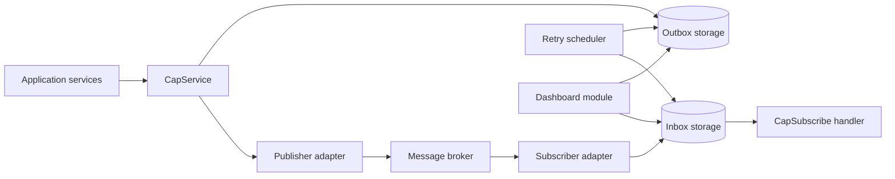
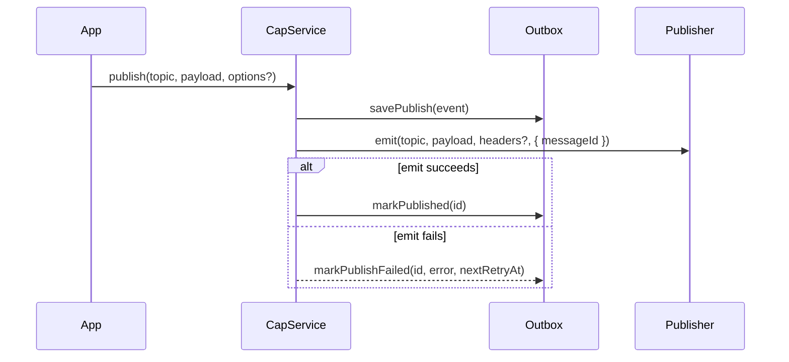

# Architecture

CAP provides reliable message publication and consumption for NestJS
applications. It does this by persisting messages before transport work and by
retrying failed outbox or inbox work through a scheduler.

CAP sits below application use cases and beside NestJS transport abstractions.
It is not a replacement for `@nestjs/microservices`; instead, CAP owns durable
message state while transport adapters decide how messages leave or enter the
process.

## System Overview

The core package owns orchestration and contracts. Storage and transport are
provided through NestJS dependency injection tokens:

- `PUBLISH_STORAGE` and `RECEIVED_STORAGE`
- `PUBLISHER` and `SUBSCRIBER`

First-party adapters currently exist for MikroORM storage, Azure Service Bus
transport, and NestJS microservices `ClientProxy` transport. Applications can
provide different adapters by implementing the same interfaces.

## Publish Flow

The outbox row is always written before an external emit is attempted. If the
transport fails, the row remains eligible for scheduler retry.

## Subscribe Flow

`CapSubscriberScanner` scans Nest providers for `@CapSubscribe` metadata and
registers handlers during module initialization. DTO validation is available
through the `dto` option on `@CapSubscribe`.

Handlers receive headers either as the second argument or through the
`@CapHeaders()` parameter decorator.

## Retry Scheduler

The scheduler is registered by `CapModule` and performs two periodic jobs:

- outbox flush every 30 seconds
- inbox retry every minute

Outbox retries claim eligible rows with a lease before emitting them. Failed
emits increment retry state and eventually move rows to `dead_letter`. Inbox
retries read due unprocessed rows and re-run the registered handler. Handler
retry timing uses exponential backoff with jitter.

## Transactions

`CapService.publish(topic, payload, { headers, tx, immediate }?)` supports
transaction-aware behavior:

- If storage implements `savePublishWithTx` and `tx` is provided, the outbox row
  is persisted with that transaction/context.
- If `tx` is provided and `immediate` is not `true`, CAP does not emit to the
  broker immediately. The scheduler publishes the row after the DB commit.
- If `immediate: true` is provided, CAP emits immediately and marks published on
  success. This is intentionally non-atomic across DB and broker.

Recommended production behavior is deferred publication: persist the outbox row
inside the same database transaction as the domain change, then emit after the
transaction commits or let the scheduler flush the row.

The helper `withTransactionAndPostCommit` exists for applications that want to
queue post-commit sends without coupling the core package to a specific ORM.

## Dashboard Role

The dashboard package is optional. It reads the same storage contracts used by
the scheduler and exposes REST endpoints plus a static UI for inspection and
manual actions. It must be protected by application-provided authentication and
authorization. A required NestJS guard authenticates requests, and an optional
operation-aware authorizer can separate read and admin permissions. CAP owns
dashboard behavior; the application owns who may call it.

## Decisions

Durable architecture decisions are documented as ADRs in [docs/adr](adr/README.md).
